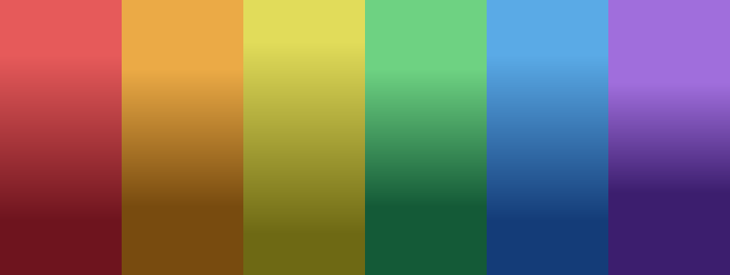

# Gradient Texture Tool

A small app for building the multi-color gradient stripe textures used to texture
**low-poly 3D models** — no complicated unwrapping workflow required.

## What it's for

A popular low-poly modeling workflow (popularized by artists like
[Imphenzia](https://www.youtube.com/@Imphenzia) and [Kay Lousberg (aka. Kay Kits)](https://www.youtube.com/@KayLousberg))
skips UV unwrapping almost entirely: instead of laying out UVs for every face, you build one
small texture made of flat color gradients, apply it to the whole model, then just make uv islands and nudge each
to sample whichever stripe (and however light or dark a point on it) you
want that face to be. One tiny texture, no unwrapping, and a clean low-poly look.

This tool makes that source texture. Define as many gradients as you like, tweak their colors
and fades, and export a PNG sized and laid out exactly how you need it.

## Features

- **Automatic layout** — any number of gradients get arranged into an even grid based on your
  chosen texture size and minimum stripe width, no manual positioning.
- **Per-gradient controls** — start/end color, fade width (anywhere from a hard edge to a smooth
  blend), and drag-and-drop reordering.
- **Full color picker** — HSL and RGB modes with live-synced sliders, a clickable 2D color
  square, a hue strip, and a hex field, all on every color swatch. Copy a gradient's start color
  to its end color (or back) with one click.
- **Import a palette** — paste any [coolors.co](https://coolors.co) export (CSV, hex list, JSON,
  XML — auto-detected) and turn each color into a start → darker-shade gradient in one step, with
  adjustable lighten/darken amounts and the ability to drop colors you don't want before importing.
- **Generate from a photo** — upload any image and either auto-detect its dominant colors
  (a "low-poly" palette extraction) or click specific spots on the image to sample exact colors
  yourself. Remove and regenerate picks as needed.
- **Live preview** — every edit re-renders instantly, at a resizable preview size.
- **Export** — save the full-resolution PNG straight to a folder of your choice.
- Runs as a **standalone desktop app** or in **any browser** — same tool, either way.

## How to use it

1. Click **+ Add gradient** (or import a palette / generate from an image) to build up a list of
   gradients.
2. Adjust each one's start color, end color, and fade width until the preview looks right.
3. Drag to reorder, and pick a texture size and minimum stripe width from the top bar.
4. Hit **Save as...** to export the PNG.
5. In Blender, apply the PNG as your model's texture, then set each face's UVs to sample the
   stripe (and vertical position within it) you want for that face.

## Running it

- **Standalone app:** double-click `GradientTextureTool.exe` — no browser needed.
- **In your browser:** double-click `start-in-browser.bat`.

Both launch the exact same app. See [Developer Notes](docs/developer-notes.md) for the project
layout and how to rebuild the standalone app after making changes.

## Inspiration

This project was inspired by
["Make Low Poly Models Look AMAZING With This Simple Gradient Trick!"](https://www.youtube.com/watch?v=9ITJgW9hVrE)
and the same gradient-texturing technique used throughout the low-poly modeling work of
creators like Imphenzia and Kay Kits.
